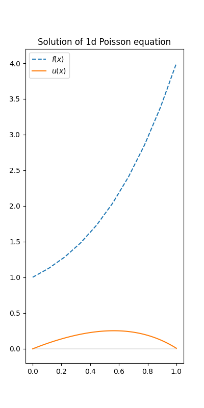

# AI4PDE-Web

余庆杯参赛项目仓库

## 项目简介

此仓库用于中国科大第二届余庆杯校园软件设计大赛，主要实现了一个基于深度学习技术的 Web 端 PDE 在线求解平台。

GitHub网页：https://github.com/TheVaticanCameos/AI4PDE-Web

### 使用方法

基本使用方法：用户在 Web 端选择需要求解的方程，输入相关参数，后端代码将执行求解过程，将求解结果反馈在 Web 端。

目前可求解的方程有：
- 带 Dirichlet 两点边值的一维 Poisson 方程 $$ \begin{aligned}
    & u''(x)=f(x), \quad x\in\left[0, 1\right]\\
    & u(0)=u(1)=0
\end{aligned} $$ 其中右端项（源项） $f(x)$ 是多项式，由用户通过指定各项系数的方式输入； $u(x)$ 是待求解的函数。
- ......

### 技术原理

目前使用的深度学习框架为深度算子网络 DeepONet [^1], 项目后端代码在实现中使用了 Lu Lu 等学者开发的 DeepXDE 框架[^2]。

--------------------

## 供开发者阅读

### 项目组织结构

本项目的组织结构如下：
```
root/
|--.idea/                       // 配置文件（无需修改）
|--back-end/                    // 后端文件（代码，模型参数，后端输出）
|   |--requirements.txt         // 后端代码环境依赖
|   |--output/                  // 后端代码的输出，用于反馈给用户
|       |--xxx.png              // 解的图像
|       |--...
|   |--params/                  // 预训练好的模型参数
|       |--params.ckpt-1000.pt  // 用于一维 Poisson 方程的模型参数
|       |--...
|   |--source/                  // 用于求解的 python 代码
|       |--infer.py             // 使用模型参数，用于一维 Poisson 方程的求解
|       |--train.py             // 训练模型参数
|       |--...
|--front-end/                   // 前端文件
|   |--pde-solver.html          // Web 前端
|   |--PDE-solver2.0.html       // ver2.0 Web 前端
|   |--server.py                // 连接到服务器
|   |--...
```

### 后端代码运行方法

> 以下步骤可能需要科学上网。

#### 准备工作：Git 下载安装

> [官网](https://git-scm.com/)，[下载链接](https://https://git-scm.com/downloads)，[官方文档](https://https://git-scm.com/doc)。

- Git: 是一个面向开源及私有软件项目的托管平台，是一个分布式的版本控制软件，它可以有效、高速地处理各种项目的版本管理。
- GitHub: 是一个用 Git 托管代码的平台（把本地的代码历史上传到云端），已成为当前人们用来管理代码及各种文档的利器。

Git 的安装可以参考 [CSDN上的Git安装教程](https://blog.csdn.net/mukes/article/details/115693833)。

#### 从 GitHub 上克隆项目

安装好后，打开 Git CMD，cd到一个空目录（cd是一个命令，Change Directory，用来更改当前工作目录），输入命令
```bash
git clone https://github.com/TheVaticanCameos/AI4PDE-Web.git
```
如果此目录中出现仓库中的这些文件，则 clone 成功，否则尝试科学上网后重试，或配置 SSH 密钥后输入命令
```bash
git clone ssh://git@github.com/TheVaticanCameos/AI4PDE-Web.git
```

#### 环境依赖搭建

##### Windows

首先安装 python，推荐 3.8 及以上版本

打开终端（cmd、Windows PowerShell 或者 vscode 中的 terminal 都可），cd 到`back-end`目录，输入如下命令创建虚拟环境
```bat
python -m venv env
```
接着输入如下命令激活虚拟环境
```bat
env\Scripts\activate
```
接下来安装第三方库，输入如下命令（此步骤如果报错或者速度太慢可尝试关闭 / 打开科学上网）
```bat
pip install -r requirements.txt
```

##### Linux

```bash
cd /path/to/back-end
python3 -m venv env
. ./env/bin/activate
pip install -r requirements.txt
```

#### 运行方法

运行`infer.py`，正常的话会在`back-end/output`目录下生成图片`poisson1d-test.png`（仓库中本来就有一张，可以将其删除后再运行）。

### `infer.py`中的部分代码解释

`poisson1d_solver(poly: dict)`函数接受一个字典`poly`，其键表示多项式的某一项次数，对应的值表示该项的系数。这一字典用于表示用户指定的右端多项式 $f(x)$。此函数将加载预训练好的模型参数`back-end/params/params.ckpt-1000.pt`，对一维 Poisson 方程求解，并将解的曲线绘制在`back-end/output/poisson1d-test.png`中，如下图所示。其中蓝色曲线表示用户输入的多项式 $f(x)$，橙色曲线表示模型输出的解 $u(x)$。

<div  align="center">    
 
</div>


[^1]: [DeepONet: Learning nonlinear operators for identifying differential equations based on the universal approximation theorem of operators.](https://arxiv.org/abs/1910.03193)
[^2]: [DeepXDE: a library for scientific machine learning and physics-informed learning.](https://github.com/lululxvi/deepxde/tree/master)
