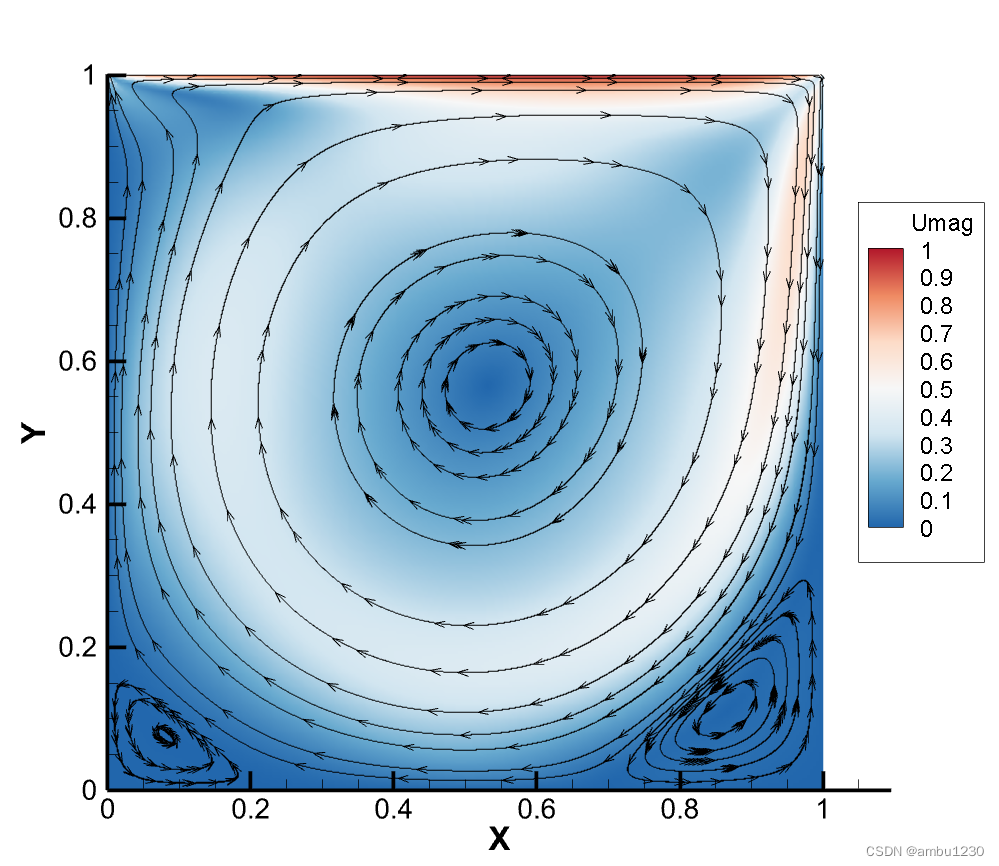
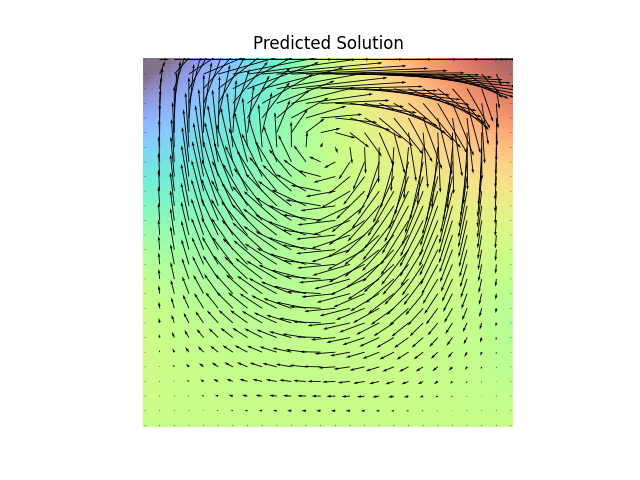

# 算例3：Stokes 流

## 数学背景

### 数学表达

本算例中求解单位正方形区域内二维含时的 Stokes 流，其数学表达形式如下：

$$
\begin{aligned}
\mu\left(\frac{\partial^2 u}{\partial x^2}+\frac{\partial^2 u}{\partial y^2}\right)-\frac{\partial p}{\partial x}&=0, x\in(0, 1), y\in(0, 1)\\
\mu\left(\frac{\partial^2 v}{\partial x^2}+\frac{\partial^2 v}{\partial y^2}\right)-\frac{\partial p}{\partial y}&=0, x\in(0, 1), y\in(0, 1)\\
\frac{\partial u}{\partial x}+\frac{\partial v}{\partial y}&=0, x\in(0, 1), y \in (0, 1)\\
u(x, 1)=u_1(x), v(x, 1)&=0, x\in(0, 1)\\
u(x, 0)=v(x, 0)=p(x, 0)&=0, x\in(0, 1)\\
u(0, y)=v(0, y)&=0, y\in(0, 1)\\
u(1, y)=v(1, y)&=0, y\in(0, 1)
\end{aligned}
$$

这是一个稳态方程，描述的是稳定状态下的各个物理量，因此和时间无关。其中 $u(x, y), v(x, y)$ 为流场中的速度的 $x, y$ 分量， $p(x, y)$ 为压力场。

### 物理意义

Stokes 流问题，也称为低雷诺数流动问题，描述的是在黏性力主导的流体流动情况中，惯性力可以忽略不计的流动。这个问题通常用来研究非常缓慢的流动，雷诺数很低（通常小于1），例如微尺度下的流体流动或流体在狭小空间中的流动。

一般的 Stokes 流问题需要一定的几何条件才能确定解。在我们的问题背景中，研究区域为二维的单位正方形。其问题背景是在单位正方形中填满不可压缩的粘性流体，其粘性系数 $\mu=0.01$ 为定值。此单位正方形左、右、下边界均为固定边界，其速度为零。在上边界处有一个无穷大的平板向右匀速运动，从而带动上表面的流体跟着运动，其速度 $u_1(x)$ 为用户指定的函数（在本算例中设定为常值函数，即与 $x$ 无关）。我们研究的是稳态时流场的速度和压强。

下图是此问题的一个图示：

<div align="center">
    
</div>

可以看到，稳态时流场会在其中心形成一个大的涡旋，角落里可能会形成小的涡旋（会根据雷诺数和流速改变而变化）。这一特定的问题也称为**方腔流问题(Cavity Flow)**。

## 后端代码说明

### 目录结构

算例3的后端内容目录如下：
```
stokes-flow/
|--train.py     // 网络训练
|--infer.py     // 网络推理
|--README.md    // 说明文档
```
其中 `train.py` 已经预先运行过，得到的网络参数保存在 `../../params/stokes-params-50000.pt` 中。

### 使用方法

在 `infer.py` 中，函数`stokes_flow_solver`用于求解Stokes流方程，其输入为上边界流场流速 $u_1(x)$，这里默认为常数函数，输出为流速场和压力场。如下所示：
```python
if __name__ == "__main__":
    sol = stokes_flow_solver(0.5)
```
其中返回值 `sol` 是一个 $n\times n\times 3$ 的 `np.array`，`sol[:, :, 0], sol[:, :, 1]` 分别表示 $x, y$ 方向的流速场，`sol[:, :, 2]` 表示压强场。其中 $n\times n$ 是空间网格分辨率。

`infer.py` 中的第 138 - 157 行为绘图函数，用于可视化输出的流场和压强场，这里仅作为可视化的示例，作为前端绘图的参考；在实际使用时可以注释这段代码，改为在前端绘制。绘制的样例如下：

<div align="center">
    
</div>

其中背景颜色表示压强场，箭头图表示流速场。可以看到中心有明显的涡旋。